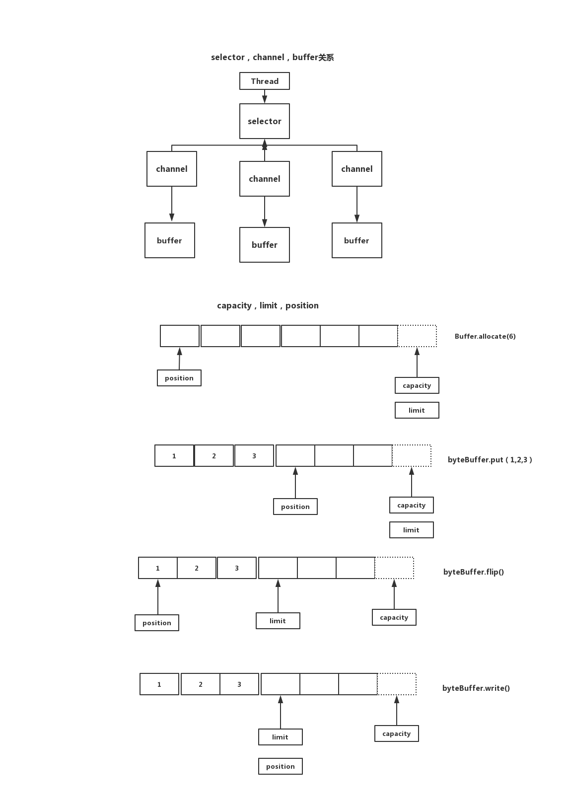

# NIO

差别最大的是服务器端

## 同步/异步/阻塞/非阻塞

- 同步

    正常调用

- 异步

    基于回调

- 阻塞

    没开线程

- 非阻塞

    开子线程

## Buffer

缓存区 相当于bio中的byte数组

本身就是一块内存，实际就是一个数组，数据的读，写都是通过buffer来实现的

- capacity

    最大容量，它永远不可能为负数，并且是不会变化的

- limit

    限制，它永远不可能为负数，并且不会大于capacity

- position

    下一个读或写的位置，它永远不可能为负数，并且不会大于limit

Java 原生6中基本类型都各自有对应都buffer类型（除了boolean外），如

- IntBuffer

- CharBuffer

- ByteBuffer

- LongBuffer

- ShortBuffer

HeapByteBuffer 堆内

    底层实现直接byte数组

DirectByteBuffer 堆外

    address成员变量，引用堆外内存。如果写到外面，DirectByteBuffer性能会更好，因为堆内内存还有拷贝的步骤。

## Selector

    轮询器，将Channel注册到Selector内。

    key set 表示注册到selector上面所有到selectionKey，通过keys()方法返回 全集

    selected-key set 表示感兴趣到selectionKey  通过selectedKeys()方法返回  子集， 只会返回发送了事件的感兴趣的事件

## Channel

相当于bio中的socket